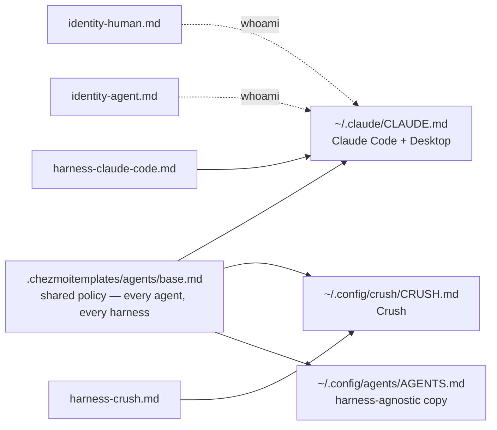

# Agent rules & identity

Every AI harness on every box reads the **same rules**, composed from one set of
partials. Add a rule once and it reaches Claude Code, Claude Desktop and Crush —
on the hub and on every spoke.

## One source, three targets



| File | Contains |
| --- | --- |
| `agents/base.md` | Everything that applies to **all** agents: git workflow, issue-tracker routing, secrets hygiene, Signal formatting, comment style, OMG policy |
| `agents/identity-human.md` / `identity-agent.md` | Whether this login is Joe or the bot — picked automatically, see below |
| `agents/harness-claude-code.md` / `harness-crush.md` | Only genuine **capability** differences (a tool one harness has and another doesn't) |

:::warning[Add rules to the partial, not the target]
`CLAUDE.md.tmpl`, `CRUSH.md.tmpl` and `AGENTS.md.tmpl` are **pure composition** —
they contain no prose of their own. A rule written inline in one of them silently
applies to that harness alone, which is exactly the drift this structure exists
to prevent.
:::

`~/.config/agents/AGENTS.md` is base + identity with **no** harness overlay.
Nothing reads it automatically today; it exists so there is one artifact to point
a human (or a future tool following the `AGENTS.md` convention) at without
picking a harness first.

## Identity — derived, never stored

**No identity value lives in this repo.** Not a username, not an email, not a
phone number. Everything resolves from two sources:

1. **`whoami` plus the `$USER` / `$USER-agent` convention.** The OS login user
   *is* the forge handle, and every install pairs a human user with a
   `<human>-agent` bot user. That makes both the handles and the acting **role**
   derivable from `whoami` alone: a login with the `-agent` suffix is the bot;
   stripping the suffix names its human. `whoami` also keys the per-user OpenBao
   bag, so the environment below is whoami-scoped by construction.
2. **OpenBao env injection.** Vault Agent renders `secret/users/<whoami>/*` into
   `~/.config/vault/secrets-static.env`; login shells source it, `czu` sources it
   before apply, and the harness daemon loads the systemd flavor.

| Env var | What it is |
| --- | --- |
| `SIGNAL_MCP_ACCOUNT` | The number this box sends **as** (scopes the signal-mcp client only — the daemon runs multi-account) |
| `SIGNAL_MCP_OPERATOR` | The human the agent serves — Signal notify target, scheduled-task summaries |
| `SIGNAL_MCP_TRUSTED_RECIPIENTS` / `_SENDERS` | Allow-lists, read at runtime |
| `FORGE_USER` | Escape hatch for a box whose OS login differs from its forge handle |

Rendered configs therefore carry **no** identity. The one exception is Claude
Desktop — a GUI app with no shell environment — where the merge script bakes the
env values at apply time. Still env-only; still no committed fallback.

**The one thing that can't be derived** is the git commit email, because no rule
maps a login to an address. Those live in `.chezmoidata.yaml` under `gitEmail`,
and getting one wrong isn't cosmetic: a forge attributes a commit by matching the
author email against that account's registered addresses, so an invented address
leaves every commit with no avatar, no profile link and no contribution credit —
permanently, since history is immutable.

### Overriding the role on one box

For a machine whose OS login doesn't follow the convention, set it in that box's
`~/.config/chezmoi/chezmoi.toml`:

```toml
[data]
agentIdentity = "joestump-agent"
```

The `-agent` suffix (or its absence) picks which identity overlay is composed
into all three files.

## Claude Code settings

`~/.claude/settings.json` is **co-owned**: a `run_onchange_` merge script
reconciles the chezmoi-declared keys with whatever Claude Code itself has
written. Edit the declared side and let the merge run — never hand-edit
`settings.json`, and never expect the merge to preserve a key it doesn't know
about.

Two hooks ship alongside it, in `dot_claude/hooks/`:

| Hook | Blocks |
| --- | --- |
| `chezmoi-edit-guard.sh` | An agent editing the **production** clone or a rendered `~/.<file>` directly |
| `chezmoi-commit-guard.sh` | An agent leaving the workbench uncommitted after editing it |

Both exist because the failure they catch is silent: the change looks applied,
then vanishes on the next `czu`. See [Editing](../workflow).
