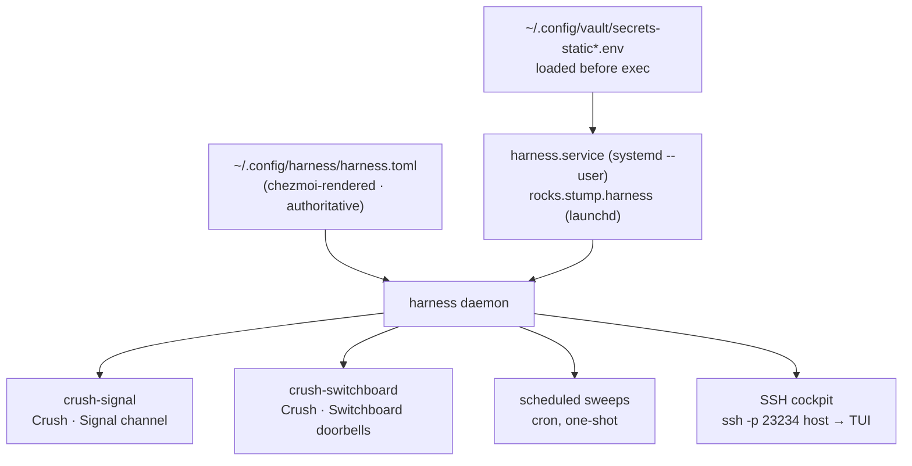

# Harness — supervised agents

[`harness`](https://github.com/stump-wtf/harness) is *systemctl for your
agents*: a Go daemon that supervises long-running agent sessions (Crush, on
these boxes), keeps them alive across crashes, lets you attach to their
terminals, and fires one-shot scheduled runs from its own cron.

It replaced the `zsh-harnessd` era — a pile of `harness@.service` units,
LaunchAgents, `tmux` servers and a standalone `claude-headless.service`. All of
that is torn down automatically on apply.



## Where it comes from

- **The binary** — built from source by
  `.chezmoiscripts/run_after_32-install-harness.sh` out of the
  `~/.local/share/harness-src` external, into `~/.local/bin/harness`.
  `go-tools.txt` also lists it as a fallback.
- **The config** — `~/.config/harness/harness.toml`, rendered from
  `dot_config/harness/harness.toml.tmpl`.
- **The service** — `systemd --user harness.service` on Linux,
  the `rocks.stump.harness` LaunchAgent on macOS (ADR-0005). Both load
  `secrets-static.env` before exec, so every provider key and MCP token reaches
  the supervised agents **without a login shell in the loop**.

## The config is authoritative

:::danger[Don't add a harness through the TUI]
The daemon's new-harness form rewrites `harness.toml` wholesale, and `czu`
re-asserts the render over it on the next run. A harness created in the TUI
lives exactly until the next sync.

Declare it in `dot_config/harness/harness.toml.tmpl` instead. Same for the
config file itself — hand-editing `~/.config/harness/harness.toml` gets reverted.
:::

And the matching caveat in the other direction: **the daemon does not re-read
its config on change** (`stump.wtf/harness#98`). A config that arrives via `czu`
needs `harness reload` — the apply-time script
(`run_onchange_after_52-harness-reload.sh`) fires that for you whenever the
config or a scheduled prompt changes.

`reload` re-applies **harness definitions only**. The `[server]` SSH listener is
started once at daemon boot, so enabling it or moving its port needs a daemon
**restart** — which tears down every running agent, so the apply script
deliberately won't do it. Restart on your own schedule:

```bash
systemctl --user restart harness                              # Linux
launchctl kickstart -k gui/$(id -u)/rocks.stump.harness       # macOS
```

## What's declared

| Harness | What it is | Autostart |
| --- | --- | :---: |
| `crush-signal` | Crush on GLM-5.2 (Z.ai), `--yolo`, driven from the **Signal** channel | no |
| `crush-switchboard` | Crush on GLM-5.2 (Z.ai), `--yolo`, woken by **Switchboard** webhook doorbells | no |
| `stumpcloud-sweep-dub` | Scheduled: StumpCloud health sweep (dub), daily 07:00 GMT | cron |
| `stumpcloud-sweep-dtw` | Scheduled: StumpCloud health sweep (dtw), daily 07:20 GMT | cron |
| `stumpcloud-sweep-pdx` | Scheduled: StumpCloud health sweep (pdx), daily 07:40 GMT | cron |
| `pr-sweep` | Scheduled: own PRs + sibling review, PRs only, Gitea; daily 09:30 GMT agent / 15:30 GMT human | cron |
| `pr-sweep-github` | Scheduled: same as pr-sweep, GitHub only; daily 10:00 GMT agent / 16:00 GMT human | cron |
| `morning-brief` | Scheduled: read-only brief of PR activity, merged PRs and new bugs; daily 09:00 GMT | cron |
| `issue-sweep` | Scheduled: issue triage + `size/*` labels, issues only; Mondays 07:00 GMT | cron |
| `blog-sweep` | Scheduled: drafts a studio blog post, opens a PR, never merges; Fridays 16:00 GMT | cron |
| `navidrome-ldap-sync` | Scheduled: navidrome-ldap fork sync + `-ldap` release tags; Sundays 06:00 GMT | cron |

**Schedules are GMT.** Every drop-in writes its cron as `CRON_TZ=UTC <cron>`.
The daemon evaluates a bare five-field cron in the box's *local* time — tars and
kitt run America/Detroit — so without the prefix a GMT-authored `30 9 * * *`
fires at 13:30 GMT in summer and 14:30 in winter.

**One channel consumer per server.** `crush-signal` carried `--channels
switchboard` alongside `signal` until 2026-08-29, and the two sessions raced for
every doorbell: webhook events landed in whichever won, usually the phone-driven
agent nobody was watching, so the queue looked dead while it was being drained.
The channels are split one-per-harness now, and each crush harness points
`CRUSH_GLOBAL_DATA` at its own data dir — so each also carries its own
chezmoi-managed model pin under `~/.local/share/<harness>/crush.json`.

:::note[No Claude Code harnesses]
`claude-code` (Remote Control) and the `claude-headless` Switchboard worker pool
were retired on 2026-09-11 — nothing runs Claude Code in the background any
more. Applying the change reloads the daemon, which stops and drops both. The
Claude Code `switchboard` MCP entry went with them: `run_after_43` drops it from
`~/.claude.json` on every host, because an endpoint nobody drains only collects
todos.
:::

The scheduled ones are **gated on the login identity and on one designated host
each** (`.sweeps.*Host` in `.chezmoidata.yaml`); `pr-sweep` and
`pr-sweep-github` are the only ones that render for the human identity too.
Their instructions live in
chezmoi-managed prompt files (`~/.config/dotfiles/*.prompt.md`), so editing a
prompt propagates with a normal `czu` and re-fires the reload.

### The lean sweep profile

The scheduled sweeps run on the local Qwen3.8-27B, whose context window is
196,608 tokens, so each sweep runs from its own `~/sweeps/<job>` directory with
a trimmed crush config:

| Piece | What it does |
| --- | --- |
| `~/sweeps/lib/RULES.md` | A ~6KB distillation of the agent rules, loaded **instead of** the 66KB `CRUSH.md` — identity and forges, the merge allowlist, the force-push ban, secrets, untrusted content, Signal, the footer, plus context hygiene and the completion contract. |
| `~/sweeps/<job>/crush.json` | Switches off every MCP server the job does not use (`"disabled": true` — a crushrc `mcp remove` cannot remove a server defined in the global config), turns off unused builtin tools including `fetch`, and points `global_context_paths` at `RULES.md`. |
| `~/sweeps/<job>/crushrc` | Disables every skill except the one the job loads. |
| `~/sweeps/<job>/ref/` | Rarely-needed procedure the prompt points at, read on demand. |
| `~/sweeps/lib/sweep-finish` | Writes `~/sweeps/results/<job>/<UTC>.json` — the run's outcome, counts and errors. A crush exit 0 does not prove a sweep finished; this record does. |

Measured on tars, a sweep session used to start at **76,290** prompt tokens
before reading anything; the lean profile starts at about **11.6k**.

Every interactive harness ships `enabled = false`: they all run with permission
prompts off (`--yolo`), so **nothing autostarts**. Start one deliberately.

### Restart policy

Every harness pins `restart = "always"` and `restart_delay = 5` rather than
taking the defaults. The default delay is `0` — instant respawn — and the
daemon's crash-loop policy is 3 exits in a 10 s window → flapping → `FAILED`,
which is terminal and needs a human. A fast-failing agent burns all five
attempts in about thirty seconds and is gone, silently, while you're away from
the desk. A 5 s delay spaces retries wider than the crash window, so a transient
failure (a provider 5xx, a Signal reconnect, an OOM) retries indefinitely
instead of latching.

The deliberate trade: a genuinely broken harness now retries forever rather than
surfacing as `failed` in `harness doctor`. For a phone-driven agent,
self-healing beats a tidy error state nobody is around to read.

## Profiles

Named sets that `harness use-profile` switches between. Exactly one carries
`autostart`.

| Profile | Harnesses |
| --- | --- |
| `default` | `crush-signal`, the `crush-switchboard` pool |
| `full` | same as `default` — kept so a box whose persisted active profile is `full` still starts its harnesses |

## Driving it

```bash
harness                       # the TUI dashboard (also: harness list)
harness describe crush-signal
harness start crush-switchboard
harness logs crush-signal --lines 200 --follow
harness attach crush-signal   # …--ro to watch without typing
harness profiles && harness use-profile full
harness reload                # re-read harness definitions
harness doctor                # config + daemon + per-harness health
```

There are also project-scoped commands (`harness up` / `down` / `ps`) that
discover a `harness.toml` at a repo root by walking up from `$PWD`.

## The SSH cockpit

The daemon can expose its full TUI over SSH, so a thin client on a phone or
laptop lands straight in the dashboard:

```bash
ssh -p 23234 <host>
```

Public-key only — there is no password path (ADR-0004, ADR-0008). The username
ssh asks for is irrelevant; Wish never checks it. **The key is the only
credential**, and it grants full typing control of every harness on the box, so
only the `joestump@` key belongs in the allow-list.

Both knobs live in OpenBao, never in the repo:

| Field in `secret/users/<you>/harness` | Becomes |
| --- | --- |
| `harness_authorized_keys` | `~/.ssh/harness_authorized_keys`, rendered by Vault Agent |
| `HARNESS_SSH_PORT` | an env var read by `harness.toml` at apply time (default `23234`) |

```bash
vault kv put secret/users/<you>/harness \
  harness_authorized_keys=@id_ed25519.pub HARNESS_SSH_PORT=23234
```

A machine whose bag has no `harness_authorized_keys` field gets no allow-list
file, and the listener accepts nobody — safe by default.

:::tip[Keep the port at the default]
The rendered `listen` line falls back to `23234` on **any** apply whose shell
lacks the secret env — `czu` sources `secrets-static.env` first, a bare
`chezmoi apply` from a non-interactive shell does not. Set `HARNESS_SSH_PORT` to
anything else and the rendered port flaps between the two across applies,
re-firing the reload script each time.
:::
