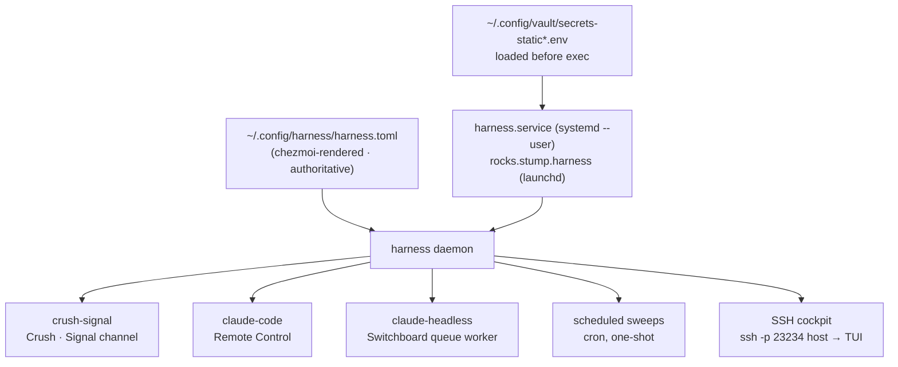

# Harness — supervised agents

[`harness`](https://gitea.stump.rocks/stump.wtf/harness) is *systemctl for your
agents*: a Go daemon that supervises long-running agent sessions (Crush, Claude
Code), keeps them alive across crashes, lets you attach to their terminals, and
fires one-shot scheduled runs from its own cron.

It replaced the `zsh-harnessd` era — a pile of `harness@.service` units,
LaunchAgents, `tmux` servers and a standalone `claude-headless.service`. All of
that is torn down automatically on apply.



## Where it comes from

- **The binary** — built from source by
  `.chezmoiscripts/run_after_32-install-harness.sh` out of the
  `~/.local/share/harness-src` external, into `~/.local/bin/harness`.
  `go-tools.txt` also lists it as a fallback.
- **The config** — `~/.config/harness/harness.toml`, rendered from
  `dot_config/harness/harness.toml.tmpl`.
- **The service** — `systemd --user harness.service` on Linux,
  the `rocks.stump.harness` LaunchAgent on macOS (ADR-0005). Both load
  `secrets-static.env` before exec, so every provider key and MCP token reaches
  the supervised agents **without a login shell in the loop**.

## The config is authoritative

:::danger[Don't add a harness through the TUI]
The daemon's new-harness form rewrites `harness.toml` wholesale, and `czu`
re-asserts the render over it on the next run. A harness created in the TUI
lives exactly until the next sync.

Declare it in `dot_config/harness/harness.toml.tmpl` instead. Same for the
config file itself — hand-editing `~/.config/harness/harness.toml` gets reverted.
:::

And the matching caveat in the other direction: **the daemon does not re-read
its config on change** (`stump.wtf/harness#98`). A config that arrives via `czu`
needs `harness reload` — the apply-time script
(`run_onchange_after_52-harness-reload.sh`) fires that for you whenever the
config or a scheduled prompt changes.

`reload` re-applies **harness definitions only**. The `[server]` SSH listener is
started once at daemon boot, so enabling it or moving its port needs a daemon
**restart** — which tears down every running agent, so the apply script
deliberately won't do it. Restart on your own schedule:

```bash
systemctl --user restart harness                              # Linux
launchctl kickstart -k gui/$(id -u)/rocks.stump.harness       # macOS
```

## What's declared

| Harness | What it is | Autostart |
| --- | --- | :---: |
| `crush-signal` | Crush on GLM-5.2 (Z.ai), `--yolo`, driven from the **Signal** and **Switchboard** channels | no |
| `claude-code` | Claude Code in `~/src` with `--remote-control` — the phone becomes a second keyboard on *this* session | no |
| `claude-headless` | Claude Code in `~/src` working the Switchboard queue | no |
| `stumpcloud-sweep` | Scheduled: StumpCloud health sweep, every 6h | cron |
| `pr-feedback-sweep` | Scheduled: keep own open PRs moving, daily 09:30 | cron |
| `issue-pr-grooming` | Scheduled: tidy stale issues/PRs, Mondays 07:00 | cron |

The three scheduled ones are **gated on the `-agent` login suffix** — a human
login renders only the interactive agents. Their instructions live in
chezmoi-managed prompt files (`~/.config/dotfiles/*.prompt.md`), so editing a
prompt propagates with a normal `czu` and re-fires the reload.

Every interactive harness ships `enabled = false`: they all run with permission
prompts off (`--yolo` / `--dangerously-skip-permissions`), so **nothing
autostarts**. Start one deliberately.

### Restart policy

Every harness pins `restart = "always"` and `restart_delay = 5` rather than
taking the defaults. The default delay is `0` — instant respawn — and the
daemon's crash-loop policy is 3 exits in a 10 s window → flapping → `FAILED`,
which is terminal and needs a human. A fast-failing agent burns all five
attempts in about thirty seconds and is gone, silently, while you're away from
the desk. A 5 s delay spaces retries wider than the crash window, so a transient
failure (a provider 5xx, a Signal reconnect, an OOM) retries indefinitely
instead of latching.

The deliberate trade: a genuinely broken harness now retries forever rather than
surfacing as `failed` in `harness doctor`. For a phone-driven agent,
self-healing beats a tidy error state nobody is around to read.

## Profiles

Named sets that `harness use-profile` switches between. Exactly one carries
`autostart`.

| Profile | Harnesses |
| --- | --- |
| `default` | `crush-signal`, `claude-headless` |
| `full` | `crush-signal`, `claude-code`, `claude-headless` |

## Driving it

```bash
harness                       # the TUI dashboard (also: harness list)
harness describe crush-signal
harness start claude-headless
harness logs claude-code --lines 200 --follow
harness attach crush-signal   # …--ro to watch without typing
harness profiles && harness use-profile full
harness reload                # re-read harness definitions
harness doctor                # config + daemon + per-harness health
```

There are also project-scoped commands (`harness up` / `down` / `ps`) that
discover a `harness.toml` at a repo root by walking up from `$PWD`.

## The SSH cockpit

The daemon can expose its full TUI over SSH, so a thin client on a phone or
laptop lands straight in the dashboard:

```bash
ssh -p 23234 <host>
```

Public-key only — there is no password path (ADR-0004, ADR-0008). The username
ssh asks for is irrelevant; Wish never checks it. **The key is the only
credential**, and it grants full typing control of every harness on the box, so
only the `joestump@` key belongs in the allow-list.

Both knobs live in OpenBao, never in the repo:

| Field in `secret/users/<you>/harness` | Becomes |
| --- | --- |
| `harness_authorized_keys` | `~/.ssh/harness_authorized_keys`, rendered by Vault Agent |
| `HARNESS_SSH_PORT` | an env var read by `harness.toml` at apply time (default `23234`) |

```bash
vault kv put secret/users/<you>/harness \
  harness_authorized_keys=@id_ed25519.pub HARNESS_SSH_PORT=23234
```

A machine whose bag has no `harness_authorized_keys` field gets no allow-list
file, and the listener accepts nobody — safe by default.

:::tip[Keep the port at the default]
The rendered `listen` line falls back to `23234` on **any** apply whose shell
lacks the secret env — `czu` sources `secrets-static.env` first, a bare
`chezmoi apply` from a non-interactive shell does not. Set `HARNESS_SSH_PORT` to
anything else and the rendered port flaps between the two across applies,
re-firing the reload script each time.
:::
