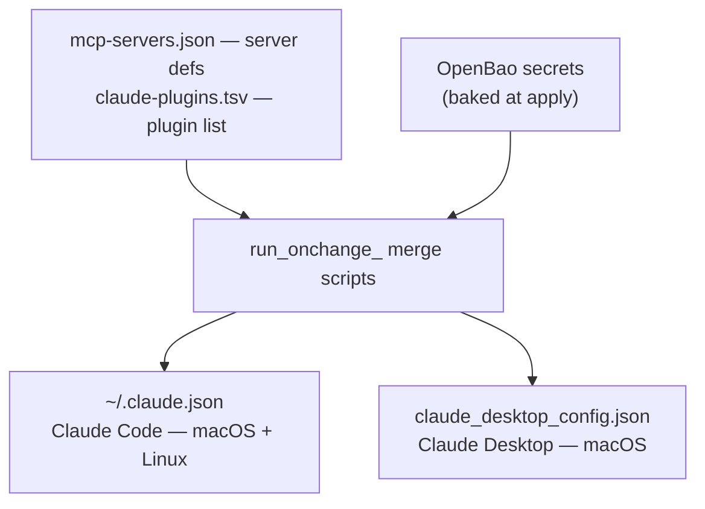

# Claude across every machine

Claude **Code** runs on the macOS mothership **and** every Linux utility node;
Claude **Desktop** runs on macOS. All of them pull the **same MCP servers and the
same plugins** from one chezmoi-managed source — edit a single file, `chezmoi
apply`, and every app on every box converges.

## What runs where

| App | macOS (mothership) | Linux (utility nodes) | Config file |
| --- | :---: | :---: | --- |
| **Claude Code** | ✓ | ✓ | `~/.claude.json` |
| **Claude Desktop** | ✓ | — *(no Linux build)* | `~/Library/Application Support/Claude/claude_desktop_config.json` |

## One source, every app

The merge handles the things that *must* differ, so you don't have to:

- **Per app** — Code tags each server with `type` and talks to the remote servers
  (`github`, `outline`) over native `http`; Desktop omits `type` and bridges them
  through `npx mcp-remote`.
- **Per OS** — `signal`'s `uv` path and `PATH` differ macOS vs Linux; the merge
  injects the right ones for the box it's running on.

## "Same MCPs across the board" — with one honest caveat

The **config** is identical on every machine, and **no server needs Docker** — they're
all `npx`/`go` stdio launchers or remote HTTP endpoints. Whether a given server
actually **connects** depends only on a lightweight runtime being present:

| Server | Connects where |
| --- | --- |
| `chrome-devtools`, `karakeep`, `outline` | everywhere (Node) |
| `github` | everywhere (remote hosted — just the PAT) |
| `gitea` | everywhere (Go build cache is warmed by chezmoi) |
| `signal` | everywhere, once the node is device-linked → [Signal](./signal) |

So the goal — *the same servers offered to Claude on every machine* — is met by the
config. The **only** per-box step is the one-time Signal device link; everything else
connects straight after `chezmoi apply`.

→ **[MCP servers](./mcp)** · **[Plugins](./plugins)** · **[Signal](./signal)**
