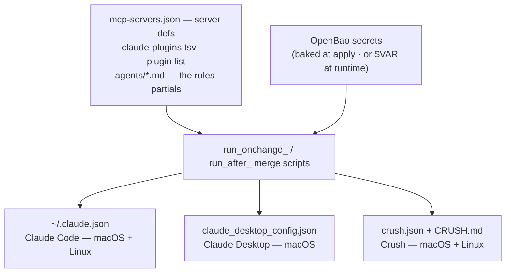

# AI tooling across every machine

Three agent surfaces run on these machines, and they all converge from one
chezmoi-managed source — MCP servers, plugins, skills and **rules**. Edit one
file, merge, `czu`, and every app on every box agrees.

## What runs where

| App | macOS (hub) | Linux (spokes) | Config |
| --- | :---: | :---: | --- |
| **Claude Code** | ✓ | ✓ | `~/.claude.json` · `~/.claude/settings.json` · `~/.claude/CLAUDE.md` |
| **Claude Desktop** | ✓ | — *(no Linux build)* | `~/Library/Application Support/Claude/claude_desktop_config.json` |
| **Crush** | ✓ | ✓ | `~/.config/crush/crush.json` · `CRUSH.md` |
| **harness** | ✓ | ✓ | `~/.config/harness/harness.toml` |

`harness` isn't an agent — it's the supervisor that keeps the other two alive as
background sessions, exposes them over SSH, and runs their cron schedules.

## One source, every app

```mermaid
flowchart TD
    src["mcp-servers.json — server defs<br/>claude-plugins.tsv — plugin list<br/>agents/*.md — the rules partials"]
    bao["OpenBao secrets<br/>(baked at apply · or $VAR at runtime)"]
    merge["run_onchange_ / run_after_ merge scripts"]
    code["~/.claude.json<br/>Claude Code — macOS + Linux"]
    desk["claude_desktop_config.json<br/>Claude Desktop — macOS"]
    crush["crush.json + CRUSH.md<br/>Crush — macOS + Linux"]
    src --> merge
    bao --> merge
    merge --> code
    merge --> desk
    merge --> crush
```

The merge handles the things that *must* differ, so you don't have to:

- **Per app** — Code tags each server with `type` and talks to the remote servers
  over native `http`; Desktop omits `type` and bridges them through
  `npx mcp-remote`.
- **Per OS** — `signal`'s `uv` path and `PATH` differ macOS vs Linux; the merge
  injects the right ones for the box it's running on.

Crush is the deliberate exception: it keeps its **own** MCP block in `crush.json`
rather than reading `mcp-servers.json`, because its credential model is different
(runtime `$VAR` expansion rather than apply-time baking).

## "Same MCPs across the board" — with one honest caveat

The **config** is identical on every machine, and **no server needs Docker** —
they're all `npx`/`go`/`uvx` stdio launchers or remote HTTP endpoints. Whether a
given server actually **connects** depends only on a lightweight runtime being
present:

| Server | Connects where |
| --- | --- |
| `chrome-devtools`, `karakeep` | everywhere (Node) |
| `outline`, `cairn`, `switchboard` | everywhere (remote HTTP — just the token) |
| `gitea` | everywhere (the Go build cache is warmed by chezmoi) |
| `aws` | everywhere — including GUI and supervised contexts, since the credential file landed |
| `signal` | everywhere, once the node is device-linked → [Signal](./signal) |
| `msgbrowse` | macOS only — the desktop app serves the endpoint |

So the goal — *the same servers offered on every machine* — is met by the config.
The **only** per-box step is the one-time Signal device link.

## Where to go

| | |
| --- | --- |
| **[MCP servers](./mcp)** | Every server, its transport, and where its token comes from |
| **[Plugins](./plugins)** | The Claude plugin/marketplace list and how it propagates |
| **[Harness](./harness)** | Supervised agent sessions, profiles, schedules, the SSH cockpit |
| **[Crush](./crush)** | Providers, its own MCP block, skills, the no-gates rule |
| **[Agent rules & identity](./agents)** | One rules source for all three, and how identity is derived |
| **[Signal](./signal)** | Device linking and the signal-cli daemon |
