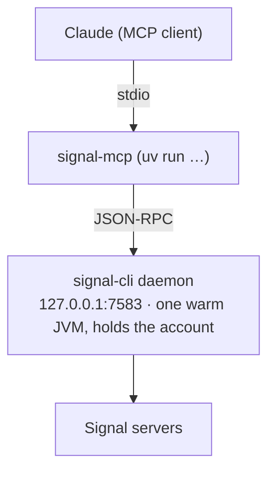

# Signal — signal-cli daemon + MCP

The `signal` MCP server lets Claude send, receive, and react to Signal messages
(it backs the "note to self" summaries scheduled tasks post). It works on **every
chezmoi node** — macOS and Linux alike — but each box needs a **one-time device
link** before it can talk to Signal.

## Architecture

Claude does **not** spawn `signal-cli` per call. A single long-running **signal-cli
daemon** holds the account and exposes JSON-RPC on `tcp 127.0.0.1:7583`; the MCP is
a thin client to it.



Why a daemon? signal-cli holds an exclusive lock on its data dir, and the JVM is
slow to start. One warm daemon avoids both the lock contention and per-call startup.

The daemon is supervised **per-OS, as you, no sudo**:

| | macOS | Linux |
| --- | --- | --- |
| Supervisor | launchd **LaunchAgent** `rocks.stump.signal-daemon` | systemd **`--user`** unit `signal-daemon` |
| Source | `Library/LaunchAgents/rocks.stump.signal-daemon.plist` | `~/.config/systemd/user/signal-daemon.service` |
| `signal-cli` | Homebrew | release tarball → `~/.local/bin/signal-cli` |
| `uv` | Homebrew | astral installer → `~/.local/bin/uv` |
| MCP repo | `~/src/signal-mcp` (**your dev checkout**) | `~/src/signal-mcp` (chezmoi external, tracks `main`) |

Everything except the device link is provisioned by `chezmoi apply`: on Linux it
installs the JRE (apt `openjdk-21-jre-headless`), `uv`, `signal-cli` (pinned
release), clones the MCP repo, warms its `uv` venv, and writes the systemd unit.

The daemon uses signal-cli's **default data dir** (no `-d`): `~/.local/share/signal-cli`
— the same place `signal-cli link` writes — with `--receive-mode on-start`. Logs go
to `~/.local/share/signal-cli/daemon.log`.

## First-time setup on a new node

`signal-cli` is a **linked device** (your phone stays the source of truth). Linking
is interactive — chezmoi runs non-interactively, so it can't do it for you.

```bash
chezmoi apply         # installs signal-cli + uv + the MCP repo (Linux), writes the unit
signal-link           # renders the device-link QR right in your terminal
```

`signal-link` prints a QR. On your phone: **Signal → Settings → Linked Devices → +
→ scan**. signal-cli blocks until you approve, then the helper **starts the daemon**
for you. Restart Claude Code / Desktop and `signal` connects.

> Linking a device does **not** move your Signal account — the phone remains primary.
> You can link many devices (one per node); unlink any of them from the same screen.

### Keep the daemon alive across logout (Linux)

A systemd `--user` service stops when your session ends. On a utility node you don't
stay logged into, enable lingering **once** (the only `sudo` in the whole flow):

```bash
sudo loginctl enable-linger $USER
```

## Day-to-day

```bash
signal-daemon {start|stop|restart|status|log|ping}
```

| Task | Command |
| --- | --- |
| Is it running? | `signal-daemon status` |
| Is the JSON-RPC port up? | `signal-daemon ping` (checks `127.0.0.1:7583`) |
| Tail the log | `signal-daemon log` |
| Restart after an update | `signal-daemon restart` |
| Re-link this device | `signal-link` |

The same `signal-daemon` verbs work on both OSes (launchd under the hood on macOS,
`systemctl --user` on Linux).

## Troubleshooting

| Symptom | Cause / fix |
| --- | --- |
| `signal` MCP fails to connect in Claude | Daemon not up. `signal-daemon ping`; if down, `signal-daemon start` (or the node was never linked → `signal-link`). |
| `signal-daemon status` shows nothing / not loaded | Not started, or (Linux) no lingering and you're in a fresh SSH session — `signal-daemon start`. |
| Daemon crash-loops in the log | Usually **not linked** — `accounts.json` has no number. Run `signal-link`. |
| "account is in use" from a `signal-cli` command | The daemon holds the data-dir lock. Don't run bare `signal-cli <cmd>` against the same account — go through the daemon (the MCP), or `signal-daemon stop` first. |
| Messages send but none arrive | Receiving needs the daemon up with `--receive-mode on-start`; confirm with `signal-daemon log`. |
| First Claude launch after a fresh node is slow / flaps | Cold `uv` venv resolve. A `run_after_` step warms it (`uv sync ~/src/signal-mcp`); it's a one-time hit. |

## The MCP repo

`~/src/signal-mcp` is the fork **`github.com/joestump/signal-mcp`** (default branch
`main`, which carries the JSON-RPC daemon client, reaction parsing, and the
trusted-recipients allowlist). On macOS this is **your own working checkout** —
chezmoi deliberately doesn't manage it. On Linux it's a chezmoi **external** that
tracks `main` (ff-only pulls, refreshed weekly). The MCP is launched with
`uv run --directory ~/src/signal-mcp signal-mcp --account <account> --operator <operator> --transport stdio`;
the per-OS `uv` path and `PATH` are injected by the
[MCP merge scripts](./mcp#the-servers).

## Two numbers: account vs operator

signal-mcp separates the number it runs **as** from the number it talks **to**:

- **`--account`** — the Signal number the daemon is logged in as (`signal-cli -a`);
  messages are sent *from* it. On this agent box that's the agent's own number
  (**+353871760709**), provisioned as `SIGNAL_MCP_ACCOUNT` in OpenBao
  (`secret/users/<you>/signal`). On a personal machine with no OpenBao it falls
  back to `.signalNumber`, so account == operator → Note to Self.
- **`--operator`** — the human the agent serves: the default recipient of the
  `send` tool and, in channel mode, the default trusted inbound sender. That's
  **joestump, +12062257886** (`.signalNumber`).

The outbound allow-list is `SIGNAL_MCP_TRUSTED_RECIPIENTS` (same OpenBao secret) —
a *gate* on who the agent may message, not an address it sends to. The daemon
`-a`, the MCP `--account`, and `signal-notify.sh` all resolve `SIGNAL_MCP_ACCOUNT`;
the MCP `--operator` and scheduled-task summaries use `.signalNumber`.

> Signal renders **no markdown** — plain text, emoji, and bare `https://` URLs only.
