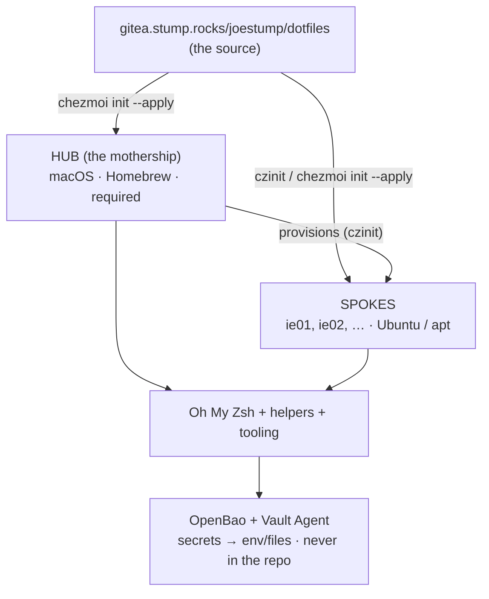

# How it all works

These dotfiles turn a fresh machine into a fully-configured one with one command.
Everything is declarative, backed by self-hosted infrastructure, and the same on
every box. Fork-friendly: change `githubUser` in `.chezmoidata.yaml` and point
`VAULT_ADDR` at your own OpenBao, and the whole setup is yours.

It's a **hub-and-spoke model**: one macOS hub you author from, any number of
Linux spokes provisioned from it.

## The pieces

| Layer | Tool | What it does |
| --- | --- | --- |
| **Dotfile management** | [chezmoi](https://chezmoi.io) | Source of truth at `~/.local/share/chezmoi`, pushed to Gitea. Renders `~/.zshrc` + `~/.oh-my-zsh/custom/` and a few configs. |
| **Shell** | Oh My Zsh | Curated plugins, helper functions auto-loaded from `$ZSH_CUSTOM`, spaceship prompt. |
| **Secrets** | OpenBao + Vault Agent | A launchd agent renders every `secret/personal/*` to env files + SSH keys on a schedule. Nothing secret is committed. |
| **Packages** | Homebrew (macOS) / apt (Linux) | A `Brewfile` and an apt list, installed by `run_onchange_` scripts. |
| **AI tooling** | Claude Code + Desktop | MCP servers and plugins managed declaratively (shared list, OpenBao-sourced tokens). |
| **CI / this site** | Gitea Actions + Garage Pages | BATS + lint on every push; this site builds and ships to Garage S3. |

## Two kinds of machine

- **The Hub** (a.k.a. the mothership) — a macOS machine, and it **must** be macOS:
  some of the stack (Claude Desktop, the launchd services) has no Linux desktop
  equivalent. Full setup: Homebrew, the Vault Agent, SSH keys, Claude config, the
  works. → [Install the Hub](install/mothership).
- **Spokes** — Linux utility nodes you spin up and tear down (`ie01`, `ie02`, …).
  Lean, apt-based, **no Homebrew**, provisioned from the hub with `czinit`.
  → [Install a Spoke](install/nodes).

## The golden rule

> Edit the **source**, not the live files. `chezmoi edit ~/.zshrc` (not `~/.zshrc`
> directly), commit, push. Pull anywhere with `chezmoi update`.

Secrets are the one thing that never lives in the repo — they come from
[OpenBao at runtime](secrets). Everything else is reproducible from `git`.
