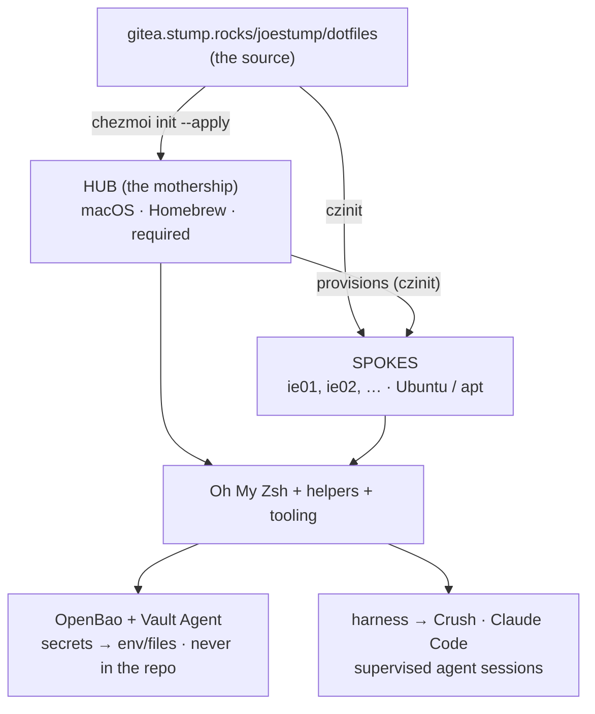

# How it all works

These dotfiles turn a fresh machine into a fully-configured one with one command.
Everything is declarative, backed by self-hosted infrastructure, and the same on
every box. Fork-friendly: change `githubUser` in `.chezmoidata.yaml` and point
`VAULT_ADDR` at your own OpenBao, and the whole setup is yours.

It's a **hub-and-spoke model**: one macOS hub you author from, any number of
Linux spokes provisioned from it.

```mermaid
flowchart TD
    src["gitea.stump.rocks/joestump/dotfiles<br/>(the source)"]
    src -->|"chezmoi init --apply"| mother["HUB (the mothership)<br/>macOS · Homebrew · required"]
    src -->|"czinit"| nodes["SPOKES<br/>ie01, ie02, … · Ubuntu / apt"]
    mother -->|"provisions (czinit)"| nodes
    mother --> omz["Oh My Zsh + helpers + tooling"]
    nodes --> omz
    omz --> bao["OpenBao + Vault Agent<br/>secrets → env/files · never in the repo"]
    omz --> agents["harness → Crush · Claude Code<br/>supervised agent sessions"]
```

## The pieces

| Layer | Tool | What it does |
| --- | --- | --- |
| **Dotfile management** | [chezmoi](https://chezmoi.io) | Two checkouts: a **production** clone chezmoi renders `$HOME` from, and a **workbench** you edit. See [Editing](workflow). |
| **Shell** | Oh My Zsh | Curated plugins, helper functions auto-loaded from `$ZSH_CUSTOM`, spaceship prompt. |
| **Secrets** | OpenBao + Vault Agent | A supervised agent renders every `secret/users/<you>/*` to env files, an AWS credentials file, a `.netrc` and SSH keys, on a schedule. Nothing secret is committed. |
| **Packages** | Homebrew (macOS) / apt (Linux) | A `Brewfile`, an apt list and a Go tools list, installed by `run_onchange_` scripts. |
| **AI tooling** | Claude Code · Claude Desktop · Crush | MCP servers, plugins and **agent rules** managed declaratively from one source. |
| **Agent supervision** | [harness](claude/harness) | A daemon that keeps agent sessions alive, exposes them over SSH, and runs their cron schedules. |
| **CI / this site** | Gitea Actions + Garage Pages | BATS + lint on every push; this site builds and ships to Garage S3. |

## Two kinds of machine

- **The Hub** (a.k.a. the mothership) — a macOS machine, and it **must** be macOS:
  some of the stack (Claude Desktop, the launchd services) has no Linux desktop
  equivalent. Full setup: Homebrew, the Vault Agent, SSH keys, Claude config, the
  works. → [Install the Hub](install/mothership).
- **Spokes** — Linux utility nodes you spin up and tear down (`ie01`, `ie02`, …).
  Lean, apt-based, **no Homebrew**, provisioned from the hub with `czinit`.
  → [Install a Spoke](install/nodes).

## The golden rule

> **Edit the workbench (`~/src/dotfiles`) — never the live files, and never
> `chezmoi edit`.** Branch, PR, merge to `main`; then `czu` on every box.

`chezmoi edit` and `chezmoi cd` open the *production* clone, which `czu` resets to
upstream `main` on every run — so anything written there is discarded, and
anything *committed* there wedges that machine's sync. The full model, and how to
test a change before it merges, is on [Editing](workflow).

Secrets are the one thing that never lives in the repo — they come from
[OpenBao at runtime](secrets). Everything else is reproducible from `git`.

## Where to go next

| If you want to… | Read |
| --- | --- |
| Set up a machine | [The Hub](install/mothership) · [A Spoke](install/nodes) |
| Know what commands exist | [Command reference](commands) |
| Change something | [Editing](workflow) · [Maintenance](maintenance) |
| Understand secrets | [Secrets](secrets) |
| Run agents | [Harness](claude/harness) · [Crush](claude/crush) · [Claude](claude/) |
| Know what runs in the background | [Services & schedules](services) |
