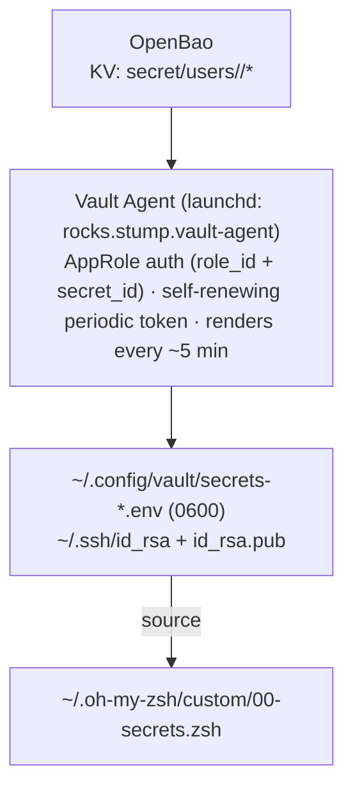

# Secrets — OpenBao + Vault Agent

Nothing secret is ever committed. Secrets live in **OpenBao** (`vault.stump.rocks`);
a **Vault Agent** under launchd renders them to local files on a schedule, and the
shell sources the result.

> Use the **`vault`** CLI (HashiCorp, API-compatible with OpenBao). The Homebrew
> `bao` binary is an unrelated BLAKE3 hashing tool — not OpenBao.

## The flow



- **Env secrets** — the static template **dynamically** exports *every* field of
  *every* `secret/users/<you>/*` KV secret. Add a new secret → it shows up automatically
  (next render or `vault-agent restart`). `ssh` is skipped (it's files).
- **SSH keys** — rendered to `~/.ssh/id_rsa` (0600) and `id_rsa.pub` (0644) from
  `secret/users/<you>/ssh`.

## Add a secret

```bash
vault kv put secret/users/<you>/myservice MY_API_KEY=sk-…
# wait ≤5 min (or: vault-agent restart), then:
exec zsh
echo $MY_API_KEY      # there it is
```

That's it — no template edits. The agent discovers it.

## Day-to-day

| Task | Command |
| --- | --- |
| Is the agent up? | `vault-agent status` |
| See what it rendered | `vault-agent env` |
| Tail its log | `vault-agent log` |
| Force a re-render | `vault-agent restart` |
| Re-auth (agent down) | `czapprole --local` (re-provisions AppRole) or `vault login -method=oidc` (fallback) |

## Over SSH (utility nodes)

OIDC login opens a `localhost:8250` callback that needs your laptop's browser. The
tooling detects you're remote and prints the tunnel. Fastest path, from your **laptop**:

```bash
vault-login <host>     # opens the tunnel AND logs in on that host
```

The agent itself talks to OpenBao directly, so once you're logged in, everything
renders without a tunnel.

## The rules

- Secrets **never** in the repo, `.envrc`, or `~/.zprofile`.
- A `gitleaks` pre-commit hook + CI scan block accidental commits.
- Non-secret config (hosts, ports, regions) goes in a project `.envrc` (direnv).
