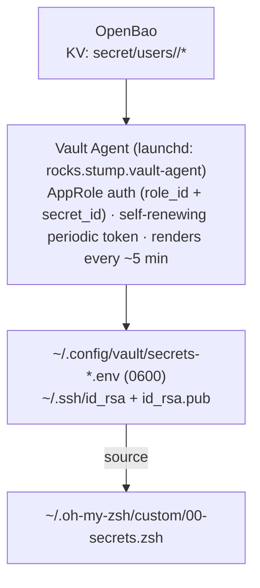

# Secrets — OpenBao + Vault Agent

Nothing secret is ever committed. Secrets live in **OpenBao** (`vault.stump.rocks`);
a **Vault Agent** under launchd renders them to local files on a schedule, and the
shell sources the result.

> Use the **`vault`** CLI (HashiCorp, API-compatible with OpenBao). The Homebrew
> `bao` binary is an unrelated BLAKE3 hashing tool — not OpenBao.

## The flow


```mermaid
flowchart TD
    bao["OpenBao<br/>KV: secret/users/<you>/*"]
    agent["Vault Agent (launchd: rocks.stump.vault-agent)<br/>AppRole auth (role_id + secret_id) · self-renewing periodic token · renders every ~5 min"]
    files["~/.config/vault/secrets-*.env (0600)<br/>~/.ssh/id_rsa + id_rsa.pub"]
    shell["~/.oh-my-zsh/custom/00-secrets.zsh"]
    bao --> agent --> files -->|source| shell
```

- **Env secrets** — the static template **dynamically** exports *every* field of
  *every* `secret/users/<you>/*` KV secret. Add a new secret → it shows up automatically
  (next render or `vault-agent restart`). `ssh` is skipped (it's files). This
  shell-format `secrets-static.env` is what most consumers read: `~/.oh-my-zsh`
  sources it, and on macOS the `rocks.stump.harness` LaunchAgent sources it
  before exec'ing the **harness daemon**, so every supervised agent session
  inherits the full set (harness layers each agent's `env_file` on top).
- **systemd `EnvironmentFile` copy** — the agent *also* renders the same secrets
  to `secrets-static.systemd.env` in systemd `EnvironmentFile` syntax (no `export`,
  double-quoted), because systemd's `EnvironmentFile=` parser can't read the shell
  format. `harness.service` consumes it (`EnvironmentFile=-…`), which is how
  supervised agents get their secrets on Linux without a login shell in the loop.
- **SSH keys** — rendered to `~/.ssh/id_rsa` (0600) and `id_rsa.pub` (0644) from
  `secret/users/<you>/ssh`.
- **Harness SSH cockpit** — a dedicated bag, `secret/users/<you>/harness`, holds
  both knobs of the daemon's remote-access surface: `harness_authorized_keys`
  (rendered to `~/.ssh/harness_authorized_keys` — the only key in it is the
  `joestump@` public key, since it grants full typing control of every harness
  on the box) and `HARNESS_SSH_PORT` (exported as an env var and read by
  harness.toml at apply time; defaults to 23234 when absent):
  ```sh
  vault kv put secret/users/<you>/harness \
    harness_authorized_keys=@id_ed25519.pub HARNESS_SSH_PORT=23234
  ```

## Add a secret

```bash
vault kv put secret/users/<you>/myservice MY_API_KEY=sk-…
# wait ≤5 min (or: vault-agent restart), then:
exec zsh
echo $MY_API_KEY      # there it is
```

That's it — no template edits. The agent discovers it.

## Day-to-day

| Task | Command |
| --- | --- |
| Is the agent up? | `vault-agent status` |
| See what it rendered | `vault-agent env` |
| Tail its log | `vault-agent log` |
| Force a re-render | `vault-agent restart` |
| Re-auth (agent down) | `czapprole --local` (re-provisions AppRole) or `vault login -method=oidc` (fallback) |

## Blast radius (per-host AppRoles)

Prefer a **per-host** role over the legacy shared `personal-vault-agent` so one
compromised or retired box can be cut off without re-provisioning the fleet:

```bash
# once per host, as admin — creates vault-agent-<host> and merges its login
# alias into your identity entity (required for the templated policy):
~/src/dotfiles/scripts/openbao-approle-setup.sh ie01

# optionally pin its creds to the box's network:
~/src/dotfiles/scripts/openbao-approle-setup.sh --cidr 10.0.0.5/32 ie01

czapprole joestump@ie01.stump.rocks   # auto-selects vault-agent-ie01

# revoke JUST that box later:
vault delete auth/approle/role/vault-agent-ie01
```

`czapprole` falls back to the shared role (with a warning) for hosts provisioned
before per-host roles existed, so nothing breaks mid-migration.

**SSH keys:** an untrusted/throwaway box shouldn't hold the shared private key.
Opt it out in that box's `~/.config/chezmoi/chezmoi.toml` — the Vault Agent there
will render env secrets but never `~/.ssh/id_rsa`:

```toml
[data]
vaultSshKeys = false
```

## Over SSH (utility nodes)

OIDC login opens a `localhost:8250` callback that needs your laptop's browser. The
tooling detects you're remote and prints the tunnel. Fastest path, from your **laptop**:

```bash
vault-login <host>              # opens the tunnel AND logs in on that host
vault-login -r admin <host>     # same, but request the admin role
```

Without `-r`, you land on the mount's `default_role` — `self-service`, which is
CRUD on your own `secret/users/<you>/*` and nothing else. Admin work needs
`-r admin`, gated on Pocket ID `admins` group membership. The same argument
works on the remote-side helper: `vault-oidc-login admin`.

The agent itself talks to OpenBao directly, so once you're logged in, everything
renders without a tunnel.

## The rules

- Secrets **never** in the repo, `.envrc`, or `~/.zprofile`.
- A `gitleaks` pre-commit hook + CI scan block accidental commits.
- Non-secret config (hosts, ports, regions) goes in a project `.envrc` (direnv).
