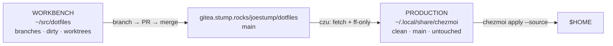

# Editing the dotfiles

There are **two clones of this repo on a developer's machine, and they have
different jobs.** Getting them confused is the single most common way to lose
work here, so it's worth 60 seconds up front.

| | **Production** | **Workbench** |
| --- | --- | --- |
| Path | `~/.local/share/chezmoi` (chezmoi's default source dir) | `~/src/dotfiles` |
| What it's for | The tree `chezmoi apply` renders `$HOME` from | Where you actually edit |
| State | Always clean, always on upstream `main` | Branches, dirty trees, worktrees — all fine |
| Who touches it | **Nobody.** `czu` enforces it every run | You |
| On a fresh spoke | Always present (`czinit` clones it) | Doesn't exist at all |

:::danger[The golden rule]
**Edit the workbench. Never edit production, and never use `chezmoi edit`.**

`chezmoi edit` and `chezmoi cd` both open **production** — the clone `czu` resets
to upstream `main`. Anything you write there is discarded on the next sync, and
if you *commit* there, `czu` stops syncing that machine entirely until a human
untangles it.
:::

Work reaches machines **only by merging to `main` upstream**. Committing in the
workbench without a merged PR changes nothing, anywhere.



## The loop

```bash
cd ~/src/dotfiles
git fetch origin && git switch -c feat/my-change origin/main

$EDITOR dot_oh-my-zsh/custom/my-helper.zsh     # edit the SOURCE file

chezmoi apply --source ~/src/dotfiles ~/.oh-my-zsh/custom/my-helper.zsh   # try it live
bats test/                                     # run the suite

git add -A && git commit -m "feat: add my-helper" && git push -u origin HEAD
# open a PR, get it green, merge — then `czu` on every box
```

The `--source ~/src/dotfiles` on that middle step is what lets you test a change
before it merges. It's deliberately temporary: the next `czu` renders from
production again and reverts it. That's the point.

## Which file do I edit?

chezmoi source names encode the target's path and attributes, so the source file
is never the same name as the file it produces:

| Source in the repo | Renders to | Why the prefix |
| --- | --- | --- |
| `dot_zshrc` | `~/.zshrc` | `dot_` → a leading `.` |
| `dot_oh-my-zsh/custom/dot.zsh` | `~/.oh-my-zsh/custom/dot.zsh` | — |
| `dot_config/private_vault/agent.hcl.tmpl` | `~/.config/vault/agent.hcl` | `private_` → dir `0700`; `.tmpl` → templated |
| `dot_config/dotfiles/executable_czu-run.zsh` | `~/.config/dotfiles/czu-run.zsh` (`+x`) | `executable_` → mode `0755` |
| `.chezmoiscripts/run_onchange_after_10-…` | *nothing* — runs at apply time | see below |

`chezmoi managed --include=files` lists every target; `chezmoi source-path <target>`
maps a live file back to its source.

## Apply-time scripts

Anything under `.chezmoiscripts/` is a **script**, not a file. The prefix decides
when it runs:

| Prefix | Runs |
| --- | --- |
| `run_once_` | Once per machine, ever (tracked by content hash) |
| `run_onchange_` | Whenever the script's *rendered* content changes — so they embed a `sha256sum` of the manifest they install from |
| `run_after_` | On **every** apply (kept cheap; they fingerprint their own inputs) |
| `…_before_` / `…_after_` | Relative to the file-apply phase |

The numeric prefix (`10-`, `40-`, `52-`) is the ordering within a phase.

Every script sources `~/.config/dotfiles/ui-lib.sh` so its output matches `czu`'s
headings and ticks — a raw `echo` in the middle of an apply is a bug, not a style
nit.

## Guard rails

- **A `gitleaks` pre-commit hook** (`core.hooksPath = .githooks`) blocks committed
  secrets. If it fires, find the secret — never `--no-verify`.
- **Two Claude Code hooks** (`dot_claude/hooks/`) stop an agent editing production
  or leaving the workbench uncommitted after touching it.
- **`bats test/`** is the suite; CI runs the same thing.
- **`make` targets** — this repo predates the house `make test lint` convention;
  run `bats test/` and the lint steps in `.gitea/workflows/ci.yml` directly.

## If czu refuses to sync

`czu` fails loudly rather than guessing, and each message names its own fix:

| Message | What happened | Fix |
| --- | --- | --- |
| `has uncommitted edits` | Something edited production | Move the change to the workbench, then `git -C ~/.local/share/chezmoi checkout -- . && git -C ~/.local/share/chezmoi clean -fd` |
| `is not on main and could not switch back` | Production is parked or detached | `git -C ~/.local/share/chezmoi switch -f main`, or delete the dir and re-run `czu` to re-clone |
| `has commits origin/main lacks` | Someone committed in production | Move those commits to the workbench **first**, then `git -C ~/.local/share/chezmoi reset --hard origin/main` |
| `no production clone … could not create one` | First run, no network or no remote | Clone the repo to `~/.local/share/chezmoi` by hand and re-run |

Production is **disposable** — deleting it and re-running `czu` is always a valid
recovery, because nothing of yours ever lived there.
